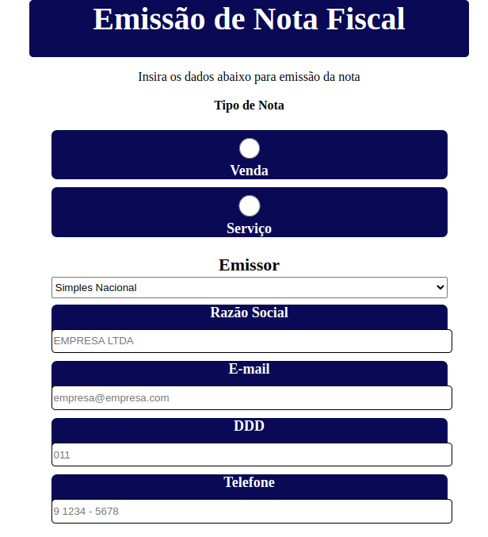
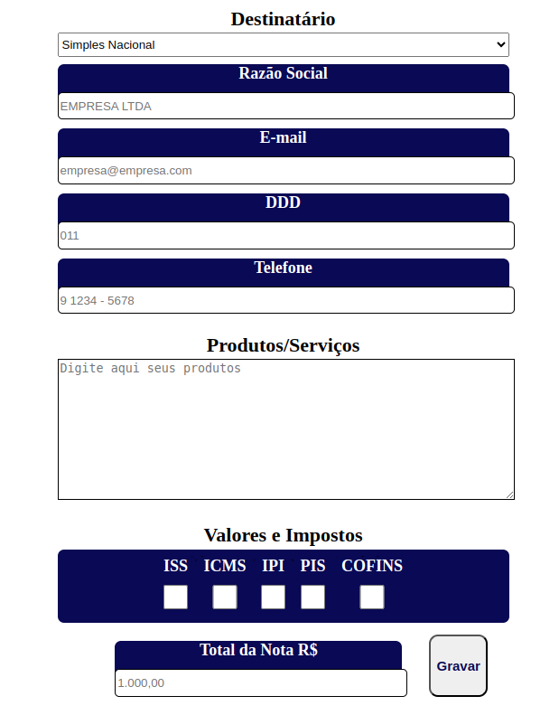
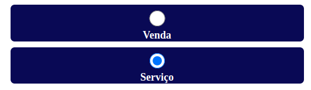
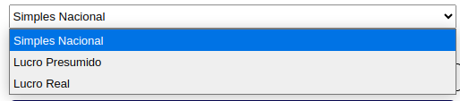

<!-- variables -->
[image]:images/logo.png

# Survey Form <a href="https://www.freecodecamp.org/">![image]</a>

Here is the entire repository for the Survey Form certificate.

This project was based on and inspired by a tax invoice form with some Brazilian taxation options.

#### Technologies Used

- HTML
- CSS

## Images

 

 

## Options

 

 
 

 
 

---

## Creator

[Benedito Braga](https://beneditobraga.github.io/portfolio/ "Meet the Creator.")

## References

[FreeCodeCamp](https://www.freecodecamp.org/ "Access the course content here.")
