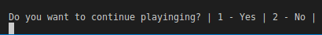
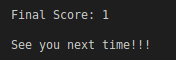

<h1 align="left">Game</h1>

Mathematical calculation game where the difficulty is based on the level informed by the player.

#### How to Play 

- First choose the level:

 

 - Answer the mathematical operation:

 
 
 - If you get it right, the game will show the operation, the score and data related to the operation:

 
 
 - Then the game will ask if you want to continue playing, if the answer is yes, it will start from the beginning adding the points already earned:

 
 
 - If the answer is "No", the game will be over:

#### Dependencies

You need the C language compiler installed and an IDE. Copy and paste the code into your IDE, compile and start playing.

## Creator

[Benedito Braga](https://www.linkedin.com/in/beneditobarroso "Meet the Creator.")

## References

[Geek University](https://www.geekuniversity.com.br/ "Access the course content here.")