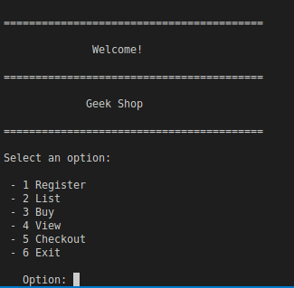
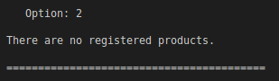
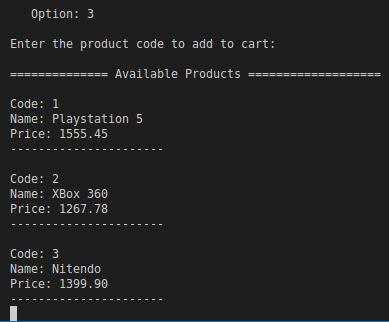
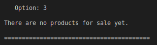
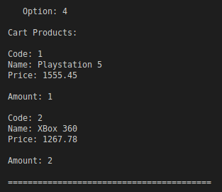
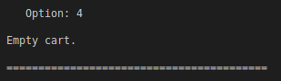
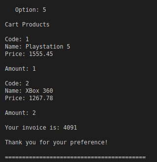
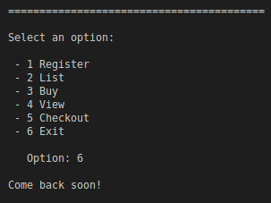

<h1 align="left">Market</h1>

Grocery shopping application. There is a menu where you can register, list and buy products. At the end, the shopping cart is displayed, asking the user whether or not they wish to proceed with the purchase.

#### How to Use 

Running the program
- Start of the Program

 

###### Option 1 - Register
 - Enter the name of the product you wish to register, for ours we entered "Playstation 5" as an example.

 

 - Enter the amount for the same product, we enter "1555.45" as an example.

 

 - This message will appear if everything went successfully.

 

 - We will register two more products for examples, as shown in the next images.

 
 

 

 ###### Option 2 - List
 - It is used to list registered products, as we did in the previous topic.

 

 - If there are no registered products, this message will appear.

 
 
 ###### Option 3 - Buy
 - Used to purchase registered products. Enter the code of the product you wish to purchase.

 

- After selecting the code, a confirmation message will appear. We chose "Code: 1" for our example. We will add more items to our cart for a multiple purchase.

 

 - If there are no registered products, this message will appear.

 

 
 ###### Option 4 - View
 - This is used to preview the shopping list before checkout. Note that in our example, we added one item with code 1 and two items with code 2.

 

- If nothing has been added as a purchase, this message will appear.

 

 ###### Option 5 - Checkout
 - It serves to confirm purchase and payment, the system will automatically add and simulate an invoice.

 

- If nothing has been added as a purchase, this message will appear.

 

 ###### Option 6 - Exit
 - It is used to exit the program at any time.

 

#### Dependencies

You need the C language compiler installed and an IDE. Copy and paste the code into your IDE, compile and start playing.

## Creator

[Benedito Braga](https://www.linkedin.com/in/beneditobarroso "Meet the Creator.")

## References

[Geek University](https://www.geekuniversity.com.br/ "Access the course content here.")